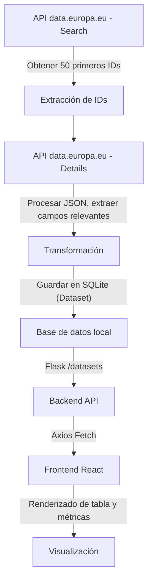

# Proyecto de Datasets Europeos

Este proyecto implementa una pequeña **pipeline de extracción, transformación y carga (ETL)** que obtiene información de datasets públicos desde la API de **[data.europa.eu](https://data.europa.eu/en)**, almacena los datos relevantes en una base de datos local y los expone a través de un backend **Flask**, consumido por una interfaz **React**.

---

## Organización del repositorio

```
├── backend/
│   ├── app.py               # Servidor Flask y endpoints
│   ├── fetch_data.py        # Lógica de extracción y procesamiento de datasets
│   ├── config.py            # Configuración previa de SQLite
│   ├── datasets.db          # Base de datos SQLite generada automáticamente
│   └── requirements.txt     # Dependencias del backend
│
├── frontend/
│   ├── src/
│   │   ├── App.js              # Página principal de React
│   │   ├── components/         
│   │       └── DatasetTable.js # Componente reutilizable
│   │   └── services/        
│   │       └── api.js          # Llamadas al backend
│   ├── package.json            # Dependencias y scripts de React
│
├── docker-compose.yml          # Orquestación de contenedores
├── README.md                   # Este documento
```

---

## Pipeline de extracción y procesamiento



### Detalle de pasos

1. **Extracción:**
   Se consultan los 50 primeros *datasets* a través del endpoint `/search/datasets` de la API de *data.europa.eu*.
   De esa respuesta se obtiene la lista de identificadores (`id`).

2. **Transformación:**
   Para cada `id`, se hace una llamada al endpoint `/api/hub/datasets/{id}`.
   De la respuesta JSON se extraen los campos:

   * `identifier`
   * `title`
   * `publisher.name`
   * `quality_meas.scoring`

3. **Carga:**
   Los datos transformados se almacenan en una base de datos **SQLite** mediante SQLAlchemy.
   Esto ocurre automáticamente al iniciar el backend (no en la primera request).

4. **Exposición:**
   El endpoint `/datasets` de Flask devuelve los registros almacenados en formato JSON.

5. **Visualización:**
   El frontend React consume ese endpoint y muestra los datasets en una tabla o lista interactiva.

---

## Tecnologías empleadas

| Componente  | Tecnología         | Descripción                                          |
| ----------- | ------------------ | ---------------------------------------------------- |
| Backend     | Flask + SQLAlchemy | API REST y persistencia en SQLite                    |
| Frontend    | React + Vite       | Interfaz web ligera para visualizar datasets         |
| API externa | data.europa.eu     | Fuente oficial de datos abiertos europeos            |
| BD local    | SQLite             | Almacenamiento persistente de los datasets extraídos |

---

## Ejecución local (sin Docker)

### Backend

```bash
cd backend
pip install -r requirements.txt
python app.py
```

### Frontend

```bash
cd frontend
npm install
npm run dev
```

El frontend se servirá en [http://localhost:3000](http://localhost:3000)
y el backend en [http://localhost:5000](http://localhost:5000).

---

## Ejecución con Docker

### 1️ Construir e iniciar los contenedores

Desde la raíz del proyecto:

```bash
docker compose up --build
```

Esto levantará:

* **Backend Flask** en `http://localhost:5000`
* **Frontend React** en `http://localhost:3000`
* (Opcionalmente) una **base de datos SQLite** dentro del contenedor del backend

### 2️ Detener los contenedores

```bash
docker compose down
```

### 3️ Ver logs en tiempo real

```bash
docker compose logs -f
```

---

## Información adicional

* Los datasets se cargan **una sola vez al iniciar el servidor**.
  Si ya existen en la base de datos, no se vuelven a insertar.
* El diseño del pipeline está desacoplado del backend, facilitando su extensión a otros orígenes de datos o bases de datos.
* Se incluye soporte opcional para **Docker** mediante `docker-compose` para ejecutar todo el stack fácilmente.

---

**Autor:** *Gabriel Postigo Vitoria*
**Versión:** 1.0
**Licencia:** MIT
